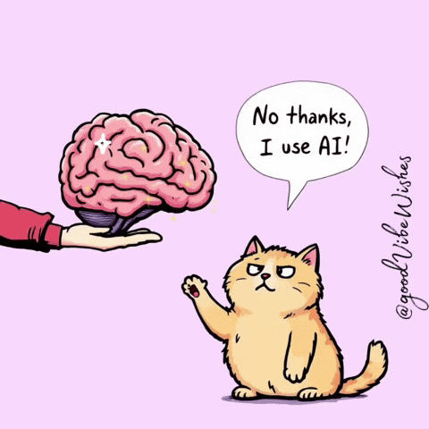

<h3 align="center">
  Welcome to my profile!
  
</h3>

  

<!-- 

  
  

 -->

### 🌿 A Few Lines

  

 

- 风越来越大，可路并没有因此更清楚。 
- 像是很多位置都在慢慢松动，一时却又想不出还能去往哪里。 
- 所以只能把手里的事再做细一点，假装自己还握得住明天。

### Frontend

  
  
  
  
  
  
  
  
  
  
  
  
  
  

### Backend

  
  
  
  
  

### Database & Cache

  
  

### DevOps & Tools

  
  
  
  
  

### Testing

  
  
  

  

  

### ✍️ A Few Words

- 有些焦虑不是脆弱，只是时代走得太快，人还没来得及想好下一站。
- 在真正找到答案之前，也许只能先低头赶路，把还能做的事做到更稳一点。
